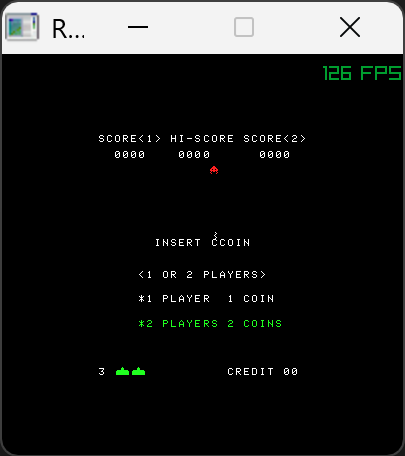
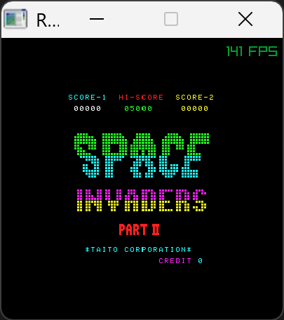
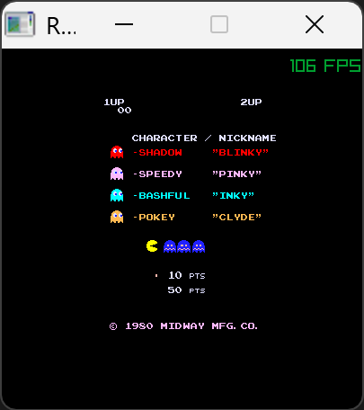
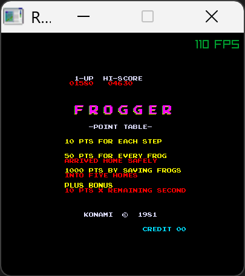

# RayLibArcade

Emulateur logiciel en C / C++, basé sur le principe de M.A.M.E.  
L'objectif est de réaliser un émulateur software pour un ESP32-P4. Cependant, ce projet existe pour "simplifier" le développement afin de ne pas avoir à flasher le micro-controleur et aussi de pouvoir avancer sur le développement sans avoir l'ESP32-P4.  

J'ai choisi d'utiliser le framework RayLib car c'est un framework que j'ai déjà utilisé pour faire de la 3D. Au final, en pur gestion bitmap 2D, cela ne se révèle pas être un bon choix car j'ai un framerate complétement à la ramasse quand je change la résolution du jeu en doublant les dimensions. C'est ok dans la résolution de base des jeux. La gestion du double buffer de RayLib est en "conflit" avec mon moteur graphique d'émulation. Pour tester c'est ok, mais cela ne sera pas utilisable en vrai sur ordinateur. Vu mon besoin, un SFML ou SDL aurait été un meilleur choix. Cela n'est pas bien grâve. J'adapterai peut-être un jour.  

Le projet "réel" est **[EspArcade](https://github.com/BorisFR/EspArcade)**. Il partage l'ensemble des fichiers sources de ce projet. Seul la partie compilation est différente.

Pour le moment, l'audio n'est pas du tout pris en compte. C'est une fonctionalité que je ne connais pas du tout, je n'ai jamais développé sur cette fonctionalité. Cela viendra plus tard quand j'aurai quelques jeux d'opérationnels.  

> <ins>Auteur :</ins> Boris  
<ins>Démarrage :</ins> Août 2025  

## Jeux  

   

## Remerciements

- La MAMEdev Team : [https://docs.mamedev.org/](https://docs.mamedev.org/)  
- Harbaum pour son Galagino - ESP32 Arcade Emulator : [https://github.com/harbaum/galagino](https://github.com/harbaum/galagino)  
- Sandroid75 pour sn émulateur PAC : [https://github.com/Sandroid75/pac](https://github.com/Sandroid75/pac)  
- Justin-Credible pour son émulateur Pacma en C# : [https://github.com/Justin-Credible/pac-man-emulator](https://github.com/Justin-Credible/pac-man-emulator)  
- tommojphillips pour son émulateur Space Invaders : [https://github.com/tommojphillips/Space-Invaders](https://github.com/tommojphillips/Space-Invaders)  
- camelliya pour son émulateur Space Invaders : [https://github.com/camelliya/pacman](https://github.com/camelliya/pacman)  
- JoseLGF pour son émulateur Space Invaders : [https://github.com/JoseLGF/SpaceIvaders](https://github.com/JoseLGF/SpaceIvaders)  
- Jean-Marc Harvengt pour son teensyMame: [https://github.com/Jean-MarcHarvengt/teensyMAME](https://github.com/Jean-MarcHarvengt/teensyMAME)  

## Blog

- <ins>Octobre 2025</ins> : Changement de l'émulateur CpuI8085 pour i8080.Semble ok pour Space Invaders mais ne fonctionne pas pour SpaceInvaders Part II. Je teste en version ESP...  Bon, au final j'avais introduit un bug dans la gestion du "dirty screen". Tout est à nouveau opérationnel et synchro en les deux versions😊.

- <ins>Octobre 2025</ins> : Début de l'implémentation du scrolling pour le jeu Frogger. Il semble que ce premier code soit opérationnel comme il le devrait. J'en suis surpris, il faut que je creuse un peu plus. J'ai un doute sur un potentiel décalage d'une ligne vers le bas.  
J'ai refait une synchro avec EspArcade. L'émulation I8080 ne fonctionne plus, l'ESP32-P4 fait un reboot à cause d'un morceau de code de ce processeur 😒  

- <ins>Octobre 2025</ins> : Le souci des INPUT_PORT est réglé : je n'avais pas implémenter toutes les touches (input du player 2 par exemple, ou encore le COIN2, COIN", START P2, ...). Maintenant que c'est implémenté, ~~le souci de joystick de Panman est réglé et~~ je sais enfin démarrer une  partie de FROGGER et même commencer à jouer. Bon, j'ai un souci avec les couleurs des sprites (pas des tiles) et je n'ai pas implémenter le scrolling. Il y a également un souci avec le nombres de vies : elles n'apparaissent pas et j'en ai un nombre infini. Pour le moment je n'ai aucune idée du pourquoi de ce phénomène.

- <ins>Octobre 2025</ins> : J'ai une première version des INPUT_PORT opérationnelle. Je me plonge dans le décodage graphique et c'est enfin un succès. J'ai les sprites de Pacman et de Frogger ! Space Invaders et sa suite sont toujours fonctionnels. Il y a cependant un "truc" avec les INPUT_PORT car au démarrage d'une partie de Pacman, le joystick ne fonctionne pas comme il devrait, je dois faire un mouvement dans toutes les directions pour que cela fonctionne correctement. Avec Frogger, je ne sais même pas simuler un COIN1. Le jeu Pacman est maintenant pleinement opérationnel ! J'ai maintenant commencé l'implémentation du clipping car les jeux positionnent des sprites sur l'écran dans des zones qui ne sont au final pas affichées.    

- <ins>Octobre 2025</ins> : Je tourne en rond, je n'arrive pas à avoir une fonction générique pour décoder les graphismes. Je plonge dans le code source de M.A.M.E. version 0.37xxx (genre pure C) et sur la toute dernière (C / C++ orienté objet). Je commence à intégrer la logique. J'en extrait du code que j'intègre dans le mien. Je commence par les macros permettant de charger les ROMS. Cela me permet d'avoir un gestionnaire de mémoire. J'intègre ensuite la partie qui gère les INPUT. Je revois complétement l'architecture logicielle de mon programme. Le tout nécessite la réécriture de nombreux morceaux de codes initial. Le programme devient plus "générique". Pour intégrer un jeu, il faut un fichier de définitions (jeu.h) qui sont majoritairement copiées depuis Mame lui-même et un fichier de codes (jeu.c) qui implémente les spécificités pour le jeu. On retrouve la logique d'implémentation de Mame car je m'en inspire énormément.  

- <ins>Septembre 2025</ins> : En "bidouillant", j'arrive à avoir les sprites opérationnels. Cependant cela ne me satisfait pas trop car cela semble trop en "dur" pour ce jeu et ne fonctionnera surement pas pour d'autres.  Je décide donc d'essayer sur un autre jeu Z80. Je choisis d'abord Crush Roller mais eu final, il y a une protection des ROM et je ne pas trop envie de m'y atteler dès à présent. Je bascule alors sur le jeu Frogger. Celui-ci utilise deux Z80, mais un des deux n'est utile que pour l'audio : cela devrait donc me suffir pour valider mon développement.  Bon, une petite adaptation est nécessaire pour les ROM car certaines ne sont pas utilisale tel quel pour avoir le graphisme. Une inversion des bit 0 et 1 a lieu sur la première rom graphique et également pour la première ROM audio.  

- <ins>Septembre 2025</ins> : J'avance doucement en analysant d'autres émulateurs Pacman. J'arrive à faire fonctionner l'émulation Z80, le souci étant ue j'aimerai ne faire que du C++ mais quasi tout les émulateurs sont en pur C. L'autre souci est au niveau graphique : il faut décoder le stockage des tiles et sprites. Je m'inspire de ces autres émulateurs, cela commence à fonctionner, au moins pour les tiles de taille 8x8. Pour les sprites 16x16, c'est un peu tout mélangé. J'ai ma fonction qui extrait les couleurs et également les palettes de couleurs. Je suis un peu perdu avec la notion de "pen" de Mame.  

- <ins>Septembre 2025</ins> : J'enchaine sur un nouveau jeu avec un autre processeur. Les jeux sur le processeur I8080 en noir et blanc sont tout de même un peu trop ancien à mon goût. Je me contenterai de Space Invaders et Space Invaders Part II.  
Le nouveau jeu aura donc de la couleur est mon choix se porte sur Pacman qui fonctionne sur un processeur Z80.  

- <ins>Septembre 2025</ins> : Histoire de valider le début du code, j'implémente un jeu ressemblant : Space Invaders Part II. Quelques soucis dans le code mais au final, cela fonctionne. Je peaufine l'affichage afin d'implémenter le filtre de couleurs.

- <ins>Août 2025</ins> : Je démarre l'écriture du code avec un jeu simple à émuler. Mon choix se porte sur Space Invaders. 
Il n'y a pas de gestion de couleur, c'est juste un filtre transparent sur l'écran.En fonction de l'emplacement du pixel allumé, le joueur le verra au travers du filtre et verra donc la courleur.  
Le jeu allume et éteint les pixels, chaque pixel est un bit d'un octet.  
Découverte du jeu, il fonctionne avec un processeur I8080. J'ai rapidement un affichage qui fonctionne. Sauf qu'il n'y a pas les envahisseurs ! Il faut implémenter les interruptions au niveau de l'émulation du processeur. J'implemente dans la foulée une gestion minimale des inputs afin de pouvoir commencer à interagir avec le jeu. J'implémente une gestion d'écran bitmap avec une gestion du "dirty" afin d'optimiser l'affichage et obtenir un 60 images par secondes au minimum sur l'ESP32-P4.